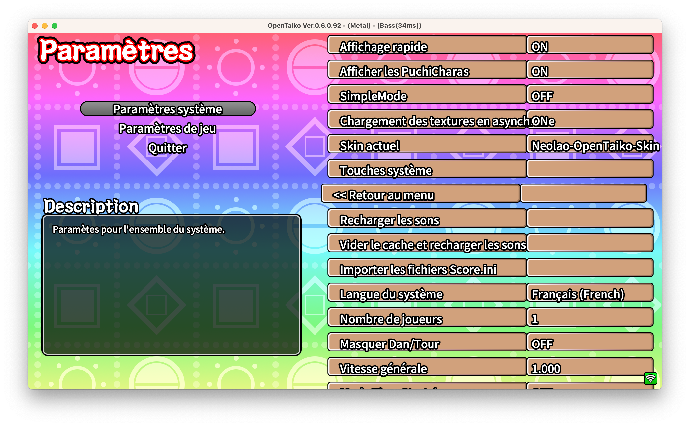
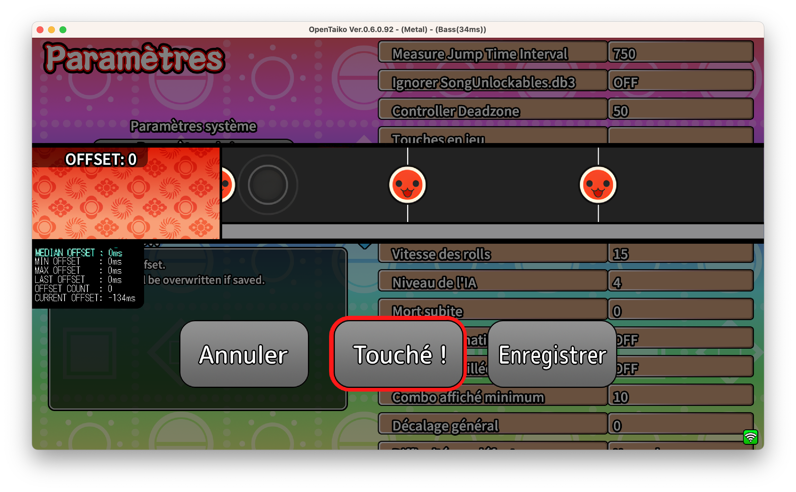

# Open Taiko's Skin by Neolao

Based on:

- https://github.com/Takkkom/OpTk-StandardStyle
- https://github.com/MoshirMoshir/Moshir-OpenTaiko-Skin

## Notes

Tested with [OpenTaiko 0.6.0.92](https://github.com/0auBSQ/OpenTaiko/releases/tag/0.6.0.92)

Images edited with Pixelmator (`.pxd` files)

## Screenshots

### Startup

### Title

### Menu

### Song select

### Settings

### Exit

